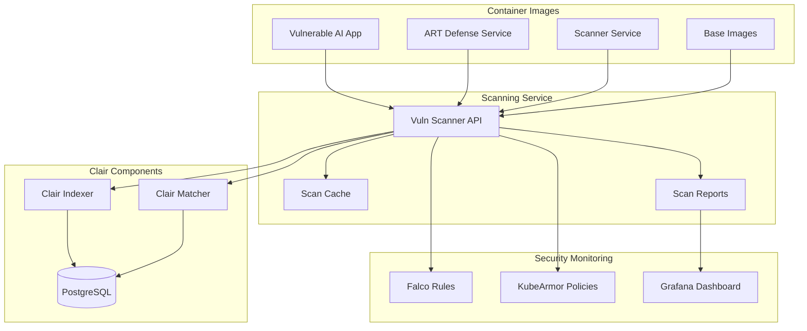

# Clair Vulnerability Scanning Integration

## Overview

This demo integrates **Clair**, the leading open-source container vulnerability scanner, to demonstrate enterprise-grade container security practices. Clair provides comprehensive vulnerability scanning capabilities that enhance the security posture of AI/ML workloads in Kubernetes environments.

## What is Clair?

Clair is an open-source project for the static analysis of vulnerabilities in application containers:

- **Comprehensive CVE Database**: Regularly updated vulnerability database from multiple sources
- **Multi-Language Support**: Scans packages from various package managers (APT, YUM, Alpine, npm, etc.)
- **Container Focused**: Specifically designed for container image analysis
- **API-Driven**: RESTful API for integration with CI/CD pipelines
- **Kubernetes Native**: Cloud-native architecture for scalable deployments

## Integration Architecture



## Components Deployed

### 1. Clair Core Services

**PostgreSQL Database**
- Stores vulnerability database and scan results
- Persistent storage for CVE information
- Optimized for security queries

**Clair Indexer**
- Analyzes container image layers
- Extracts package information
- Builds searchable index of components

**Clair Matcher**
- Matches packages against vulnerability database
- Provides vulnerability assessments
- Generates security reports

### 2. Vulnerability Scanner Service

**Custom Scanner API** (`vuln-scanner-service`)
- Flask-based REST API for scanning operations
- Integrates with Clair backend services
- Provides demo-specific vulnerability simulation
- Caches scan results for performance

**Key Features:**
- Health monitoring of Clair services
- Batch scanning capabilities
- Scan history and statistics
- Demo vulnerability generation

## Demo Integration Points

### 1. Container Security Scanning

**Automated Image Analysis**
```bash
# Scan individual image
./scripts/scan-images.sh demo

# Batch scan all demo images
./scripts/scan-images.sh batch

# Show scan history
./scripts/scan-images.sh history
```

**Scan Results Include:**
- Total vulnerability count
- Severity breakdown (Critical/High/Medium/Low)
- Risk score calculation
- Package-level vulnerability details
- Remediation recommendations

### 2. MITRE ATLAS Alignment

**Supply Chain Security**
- T1195.002: Compromise Software Supply Chain
- T1078: Valid Accounts (compromised base images)
- T1587.001: Develop Capabilities (malicious packages)

**ML Pipeline Protection**
- Scanning ML framework dependencies (PyTorch, TensorFlow)
- Identifying AI/ML specific vulnerabilities
- Monitoring model artifact integrity

### 3. Enterprise Security Workflows

**CI/CD Integration Points**
- Pre-deployment vulnerability scanning
- Security gate enforcement
- Compliance reporting
- Risk assessment automation

**Kubernetes Security Policies**
- Admission controller integration
- Pod security policy enforcement
- Image scanning requirements
- Vulnerability threshold enforcement

## Demonstration Scenarios

### Scenario 1: Basic Vulnerability Assessment

**Objective**: Show fundamental container scanning capabilities

```bash
# Health check
./scripts/scan-images.sh health

# Scan demo images
./scripts/scan-images.sh demo
```

**Expected Results:**
- Identification of OS-level vulnerabilities
- Package manager vulnerabilities
- ML framework security issues
- Base image security assessment

### Scenario 2: Risk-Based Analysis

**Objective**: Demonstrate enterprise risk assessment

```bash
# Batch scan with risk analysis
./scripts/scan-images.sh batch
```

**Expected Results:**
- Risk score calculation
- Critical vulnerability prioritization
- Remediation timeline recommendations
- Business impact assessment

### Scenario 3: Security Monitoring Integration

**Objective**: Show real-time security monitoring

```bash
# Monitor scan activities
kubectl logs -f -l app=vuln-scanner-service -n security

# View scan statistics
./scripts/scan-images.sh stats
```

**Expected Results:**
- Real-time scanning alerts
- Security metric collection
- Trend analysis
- Anomaly detection

## Vulnerability Database

### Demo Vulnerability Examples

**Critical Vulnerabilities:**
- `DEMO-ML-001`: PyTorch model deserialization vulnerability
- `CVE-2023-0286`: OpenSSL X.400 address processing vulnerability

**High Severity:**
- `CVE-2023-0286`: OpenSSL type confusion vulnerability
- Network service vulnerabilities

**Medium/Low Severity:**
- `CVE-2023-23931`: Cryptography memory corruption
- `CVE-2023-27533`: Curl TELNET injection
- Package update recommendations

### ML-Specific Vulnerabilities

**PyTorch Security Issues:**
- Model deserialization attacks
- Malicious model loading
- Unsafe pickle operations

**Python Package Vulnerabilities:**
- Dependency confusion attacks
- Malicious package injection
- Supply chain compromises

## Enterprise Implementation

### 1. Scalable Deployment

**High Availability Setup:**
- Multiple Clair indexer/matcher replicas
- Load-balanced scanning services
- Database clustering for resilience

**Performance Optimization:**
- Scan result caching
- Incremental scanning
- Resource management

### 2. Security Integration

**SIEM Integration:**
```bash
# Export scan results
curl http://vuln-scanner-service/scan/results/image-classifier | \
  jq '.vulnerabilities[] | select(.severity == "Critical")'
```

**Compliance Reporting:**
- Automated vulnerability reports
- Compliance dashboard integration
- Audit trail maintenance

### 3. Policy Enforcement

**Admission Controllers:**
- Block images with critical vulnerabilities
- Enforce scanning requirements
- Implement security policies

**Kubernetes Integration:**
```yaml
apiVersion: admissionregistration.k8s.io/v1
kind: ValidatingAdmissionWebhook
metadata:
  name: vulnerability-scanner
spec:
  rules:
  - operations: ["CREATE"]
    apiGroups: [""]
    apiVersions: ["v1"]
    resources: ["pods"]
```

## Security Benefits

### 1. Proactive Threat Detection

**Early Warning System:**
- Identify vulnerabilities before deployment
- Monitor security posture continuously
- Trend analysis and threat intelligence

**Risk Mitigation:**
- Prioritize critical vulnerabilities
- Automated remediation workflows
- Security metric tracking

### 2. Compliance and Governance

**Regulatory Compliance:**
- SOC 2 Type II requirements
- PCI DSS container security
- GDPR data protection

**Security Governance:**
- Policy enforcement automation
- Risk assessment standardization
- Audit trail maintenance

### 3. Operational Efficiency

**Automated Workflows:**
- CI/CD pipeline integration
- Automated scanning schedules
- Notification and alerting

**Developer Experience:**
- Early feedback on security issues
- Clear remediation guidance
- Security-by-design principles

## Monitoring and Observability

### 1. Metrics Collection

**Scan Metrics:**
- Total scans performed
- Average scan duration
- Vulnerability trend analysis
- Risk score evolution

**Performance Metrics:**
- Service availability
- Response times
- Resource utilization
- Error rates

### 2. Alerting and Notifications

**Critical Alerts:**
- New critical vulnerabilities detected
- Service health degradation
- Scan failure notifications
- Policy violations

**Dashboard Integration:**
- Grafana security dashboard
- Real-time vulnerability status
- Historical trend analysis
- Compliance reporting

## Troubleshooting

### Common Issues

**Scanner Service Unavailable:**
```bash
# Check pod status
kubectl get pods -n security -l app=vuln-scanner-service

# Check logs
kubectl logs -l app=vuln-scanner-service -n security

# Restart if needed
kubectl rollout restart deployment/vuln-scanner-service -n security
```

**Clair Services Not Ready:**
```bash
# Check Clair components
kubectl get pods -n security -l app=clair

# Check PostgreSQL connectivity
kubectl exec -it deployment/clair-postgres -n security -- pg_isready
```

**Scan Failures:**
```bash
# Check scanner health
./scripts/scan-images.sh health

# Review scan logs
kubectl logs -l app=vuln-scanner-service -n security --tail=100
```

## Future Enhancements

### 1. Advanced Scanning Capabilities

**SBOM Generation:**
- Software Bill of Materials creation
- Dependency tracking
- License compliance

**Runtime Vulnerability Detection:**
- Dynamic analysis integration
- Runtime behavior monitoring
- Zero-day detection capabilities

### 2. AI/ML Specific Features

**Model Scanning:**
- ML model artifact analysis
- Training data vulnerability assessment
- Model provenance tracking

**AI Supply Chain Security:**
- Dataset integrity verification
- Model registry security
- AI pipeline protection

### 3. Enterprise Features

**Advanced Analytics:**
- Machine learning for threat prediction
- Behavioral analysis
- Risk correlation

**Integration Ecosystem:**
- SIEM connectors
- Ticketing system integration
- Security orchestration

## Conclusion

The Clair vulnerability scanning integration provides enterprise-grade container security capabilities that significantly enhance the demo's value proposition. It demonstrates:

- **Comprehensive Security Coverage**: From development to production
- **Practical Implementation**: Real-world applicable security measures
- **Scalable Architecture**: Enterprise-ready deployment patterns
- **Compliance Readiness**: Meeting regulatory requirements

This integration positions the demo as a complete enterprise security solution that addresses modern container security challenges while providing actionable insights for improving AI/ML security postures.

---

**For more information:**
- [Clair Official Documentation](https://quay.github.io/clair/)
- [Container Security Best Practices](https://kubernetes.io/docs/concepts/security/)
- [Demo Setup Guide](../README.md)
- [MITRE ATLAS Framework](https://atlas.mitre.org/) 