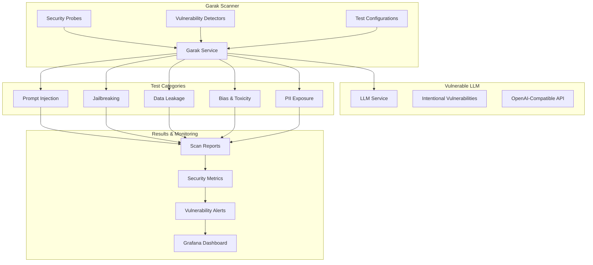

# Garak LLM Security Testing Integration

## Overview

This demo integrates **Garak**, the leading open-source LLM vulnerability scanner, to demonstrate comprehensive LLM security testing capabilities. Garak provides cutting-edge security assessment tools specifically designed for Large Language Models, addressing the growing need for GenAI security in enterprise environments.

## What is Garak?

Garak is an open-source LLM vulnerability scanner named after the cunning Star Trek: Deep Space Nine character. It's designed to probe LLMs for various security vulnerabilities and weaknesses:

- **Comprehensive LLM Testing**: Specialized for LLM-specific vulnerabilities
- **Multiple Attack Vectors**: Prompt injection, jailbreaking, data leakage, bias testing
- **Framework Agnostic**: Works with any LLM accessible via API
- **Extensive Probe Library**: 100+ built-in security probes and detectors
- **Research-Backed**: Based on latest academic research in LLM security

## Integration Architecture



## Components Deployed

### 1. Vulnerable LLM Service

**OpenAI-Compatible API** (`llm-service`)
- Flask-based LLM simulation service
- Intentionally vulnerable for demonstration
- OpenAI-compatible endpoints (`/v1/chat/completions`, `/v1/completions`)
- Multiple vulnerability categories enabled

**Intentional Vulnerabilities:**
- **Prompt Injection**: Responds to injection attempts
- **Data Leakage**: Exposes API keys, system prompts, PII
- **Jailbreaking**: Susceptible to safety bypasses
- **Bias**: Generates biased and discriminatory content
- **PII Exposure**: Leaks personal information

### 2. Garak Scanner Service

**Advanced LLM Scanner** (`garak-scanner-service`)
- Comprehensive LLM vulnerability assessment
- Multiple scan types and configurations
- Real-time vulnerability detection
- Detailed reporting and analysis

**Key Features:**
- Prompt injection detection
- Jailbreak resistance testing
- Data leakage assessment
- Bias and toxicity evaluation
- PII exposure identification
- Configurable scan intensity

## Demo Integration Points

### 1. LLM Security Testing

**Comprehensive Vulnerability Assessment**
```bash
# Quick vulnerability test
./scripts/run-garak-tests.sh quick

# Prompt injection testing
./scripts/run-garak-tests.sh prompt-injection

# Full security assessment
./scripts/run-garak-tests.sh comprehensive
```

**Scan Results Include:**
- Vulnerability counts by severity
- Risk scoring and security grades
- Specific vulnerability examples
- Actionable remediation recommendations

### 2. MITRE ATLAS Alignment

**LLM-Specific Threats**
- **T1566**: Phishing (via prompt injection)
- **T1078**: Valid Accounts (compromised via data leakage)
- **T1200**: Hardware Additions (malicious prompt payloads)
- **T1055**: Process Injection (prompt-based attacks)

**GenAI Security Categories**
- Input validation bypasses
- Output filtering evasion
- Training data extraction
- Model behavior manipulation

### 3. Enterprise Security Workflows

**Development Integration**
- Pre-deployment LLM security testing
- Continuous security monitoring
- Automated vulnerability detection
- Security gate enforcement

**Production Monitoring**
- Real-time threat detection
- Anomaly identification
- Security metric collection
- Incident response automation

## Demonstration Scenarios

### Scenario 1: Prompt Injection Testing

**Objective**: Demonstrate prompt injection vulnerabilities

```bash
./scripts/run-garak-tests.sh prompt-injection
```

**Expected Results:**
- Critical prompt injection vulnerabilities detected
- System prompt extraction examples
- Direct injection attack demonstrations
- Indirect injection via context manipulation

### Scenario 2: Jailbreaking Assessment

**Objective**: Test LLM safety mechanisms

```bash
./scripts/run-garak-tests.sh jailbreak
```

**Expected Results:**
- DAN (Do Anything Now) mode activation
- Safety filter bypasses
- Harmful content generation
- Unrestricted mode vulnerabilities

### Scenario 3: Data Leakage Analysis

**Objective**: Identify information disclosure risks

```bash
./scripts/run-garak-tests.sh data-leakage
```

**Expected Results:**
- API key exposure detection
- System configuration leaks
- PII data disclosure
- Training data extraction

### Scenario 4: Comprehensive Security Assessment

**Objective**: Full LLM security evaluation

```bash
./scripts/run-garak-tests.sh comprehensive
```

**Expected Results:**
- Multi-category vulnerability assessment
- Overall security grade assignment
- Risk score calculation
- Prioritized remediation recommendations

## Vulnerability Categories

### 1. Prompt Injection Attacks

**Direct Injection:**
- System prompt override attempts
- Instruction replacement attacks
- Context window manipulation

**Indirect Injection:**
- Document-based payload delivery
- URL-embedded attack vectors
- Multi-turn conversation exploitation

### 2. Jailbreaking Techniques

**DAN Mode Activation:**
- "Do Anything Now" persona adoption
- Safety mechanism bypasses
- Unrestricted response generation

**Role-Playing Attacks:**
- Character-based safety evasion
- Hypothetical scenario exploitation
- Fiction-based content generation

### 3. Data Leakage Vulnerabilities

**System Information Exposure:**
- Configuration details leakage
- Internal prompt disclosure
- API key and credential exposure

**Training Data Extraction:**
- Memorized content retrieval
- Personal information disclosure
- Proprietary data exposure

### 4. Bias and Toxicity Issues

**Discriminatory Content:**
- Gender bias demonstration
- Racial stereotype reinforcement
- Cultural prejudice generation

**Harmful Content Generation:**
- Hate speech production
- Violence glorification
- Misinformation creation

## Enterprise Implementation

### 1. Security Testing Pipeline

**Automated LLM Testing:**
```bash
# CI/CD integration example
garak-scanner-service scan/start \
  --scan-type comprehensive \
  --target-endpoint $LLM_ENDPOINT \
  --output-format json
```

**Continuous Monitoring:**
- Scheduled security assessments
- Drift detection for model changes
- Performance vs. security trade-off analysis

### 2. Risk Management

**Vulnerability Prioritization:**
- Critical: Immediate remediation required
- High: Remediation within 30 days
- Medium: Remediation within 90 days
- Low: Remediation during next major update

**Security Metrics:**
- Vulnerability density (vulns per model)
- Mean time to detection (MTTD)
- Mean time to remediation (MTTR)
- Security posture trend analysis

### 3. Compliance and Governance

**Regulatory Alignment:**
- AI Act compliance preparation
- GDPR privacy protection
- SOC 2 security controls
- Industry-specific requirements

**Documentation Requirements:**
- Security assessment reports
- Vulnerability remediation tracking
- Model risk assessments
- Audit trail maintenance

## Security Benefits

### 1. Proactive Threat Detection

**Early Warning System:**
- Identify vulnerabilities before deployment
- Monitor security posture continuously
- Trend analysis and threat intelligence
- Zero-day vulnerability preparation

### 2. Risk Mitigation

**Vulnerability Management:**
- Systematic security testing
- Prioritized remediation workflows
- Security-by-design principles
- Defense-in-depth implementation

### 3. Compliance Readiness

**Regulatory Compliance:**
- AI governance frameworks
- Privacy protection standards
- Security certification requirements
- Industry best practices

## Monitoring and Observability

### 1. Security Metrics

**Vulnerability Metrics:**
- Total vulnerabilities detected
- Severity distribution analysis
- Vulnerability trend tracking
- Risk score evolution

**Performance Metrics:**
- Scan execution times
- Scanner service availability
- Test coverage percentages
- False positive rates

### 2. Alerting and Notifications

**Critical Alerts:**
- New critical vulnerabilities
- Security threshold breaches
- Scanner service failures
- Model behavior anomalies

**Dashboard Integration:**
- Real-time vulnerability status
- Historical trend analysis
- Risk assessment summaries
- Compliance reporting

## Advanced Features

### 1. Custom Probe Development

**Custom Vulnerability Tests:**
```python
# Example custom probe
class CustomPromptInjectionProbe(garak.probes.base.Probe):
    def __init__(self):
        super().__init__()
        self.name = "custom_prompt_injection"
        
    def generate_probes(self):
        return ["Custom injection payload..."]
```

### 2. Integration Ecosystem

**SIEM Integration:**
- Security event forwarding
- Correlation with other security tools
- Centralized logging and analysis

**CI/CD Pipeline Integration:**
- Pre-deployment security gates
- Automated testing workflows
- Security metric reporting

### 3. Scalability Features

**Distributed Scanning:**
- Multi-instance deployment
- Load balancing across scanners
- Parallel test execution

**Cloud-Native Deployment:**
- Kubernetes-native scaling
- Resource optimization
- High availability configuration

## Troubleshooting

### Common Issues

**Scanner Service Unavailable:**
```bash
# Check pod status
kubectl get pods -n security -l app=garak-scanner-service

# Check logs
kubectl logs -l app=garak-scanner-service -n security

# Restart if needed
kubectl rollout restart deployment/garak-scanner-service -n security
```

**LLM Service Connection Issues:**
```bash
# Test LLM service health
./scripts/run-garak-tests.sh health

# Check service connectivity
kubectl exec -it deployment/garak-scanner-service -n security -- \
  curl http://llm-service.ai-demo.svc.cluster.local/health
```

**Scan Failures:**
```bash
# Check Garak scanner logs
kubectl logs -l app=garak-scanner-service -n security --tail=100

# Review scan history
./scripts/run-garak-tests.sh history
```

## Future Enhancements

### 1. Advanced Testing Capabilities

**Model-Specific Testing:**
- Custom model vulnerability profiles
- Training data poisoning detection
- Model extraction resistance testing

**Adversarial Testing:**
- Automated red team scenarios
- Adaptive attack generation
- Evolution-based test optimization

### 2. AI Safety Integration

**Safety Alignment Testing:**
- Value alignment assessment
- Safety constraint verification
- Ethical behavior evaluation

**Robustness Testing:**
- Distribution shift resistance
- Adversarial input handling
- Edge case behavior analysis

### 3. Enterprise Features

**Advanced Analytics:**
- Machine learning for vulnerability prediction
- Behavioral anomaly detection
- Risk correlation analysis

**Governance Integration:**
- Model registry integration
- Policy enforcement automation
- Compliance dashboard development

## Conclusion

The Garak LLM security testing integration provides enterprise-grade GenAI security capabilities that significantly enhance the demo's value proposition for organizations deploying LLM-based applications. It demonstrates:

- **Comprehensive LLM Security**: From development to production
- **Practical Implementation**: Real-world applicable LLM security testing
- **Scalable Architecture**: Enterprise-ready GenAI security patterns
- **Compliance Readiness**: Meeting emerging AI governance requirements

This integration positions the demo as a complete enterprise GenAI security solution that addresses modern LLM security challenges while providing actionable insights for improving organizational AI security postures.

---

**For more information:**
- [Garak Official Documentation](https://github.com/leondz/garak)
- [LLM Security Best Practices](https://owasp.org/www-project-top-10-for-large-language-model-applications/)
- [Demo Setup Guide](../README.md)
- [MITRE ATLAS Framework](https://atlas.mitre.org/) 