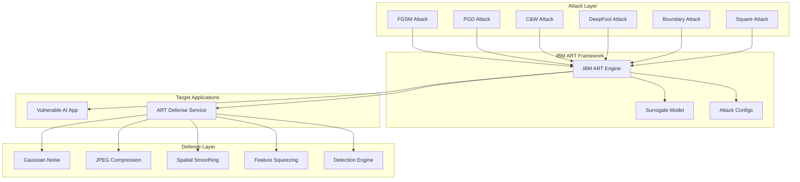

# IBM ART Integration - Enterprise AI Security Enhancement

## Overview

This demo now features **IBM Adversarial Robustness Toolbox (ART)** integration, providing enterprise-grade AI security capabilities that significantly enhance the sophistication and realism of our MITRE ATLAS T1551 (Evade ML Model) demonstrations.

## What is IBM ART?

IBM ART is the leading open-source library for AI security, providing:

- **Comprehensive Attack Methods**: 40+ adversarial attack implementations
- **Robust Defense Mechanisms**: Input preprocessing, output postprocessing, and training-time defenses
- **Framework Agnostic**: Supports TensorFlow, PyTorch, JAX, and more
- **Production Ready**: Used in enterprise environments worldwide
- **Research Foundation**: Based on cutting-edge academic research

## Integration Architecture



## Enhanced Attack Capabilities

### 1. Advanced Adversarial Methods

**Carlini & Wagner L2 Attack**
- State-of-the-art optimization-based attack
- Minimal perturbation with high success rate
- Demonstrates sophisticated threat actor capabilities

**DeepFool Attack**
- Geometrically-inspired perturbation generation
- Finds minimal adversarial perturbations
- Shows vulnerability of decision boundaries

**Boundary Attack**
- Black-box attack requiring only model predictions
- No gradient information needed
- Realistic threat model for production systems

**Square Attack**
- Query-efficient black-box method
- Practical for rate-limited APIs
- Demonstrates real-world attack feasibility

### 2. Defense Demonstrations

**Multi-Layer Preprocessing**
- Gaussian noise injection
- JPEG compression artifacts
- Spatial smoothing
- Feature squeezing (bit depth reduction)

**Adversarial Detection**
- Prediction consistency analysis
- Entropy-based anomaly detection
- Multi-defense comparison
- Real-time threat assessment

## Demo Integration Points

### 1. Enhanced Attack Scenarios

```bash
# Run IBM ART advanced attack suite
./scripts/run-attack.sh art

# Demonstrates:
# - 6 sophisticated attack methods
# - Vulnerable vs defended model comparison
# - Real-time defense effectiveness
# - Adversarial detection capabilities
```

### 2. Dual Application Architecture

**Vulnerable Application** (`image-classifier`)
- Intentionally insecure ML service
- No defensive measures
- Demonstrates attack success

**Defended Application** (`art-defense-service`)
- IBM ART-powered defense system
- Real-time adversarial detection
- Graduated defense levels
- Performance/security trade-offs

### 3. Security Monitoring Integration

**KubeArmor Policies**
- Monitor ART attack tool execution
- Detect sophisticated ML library usage
- Runtime behavioral analysis

**Falco Rules**
- Advanced attack pattern detection
- Enterprise-grade threat hunting
- Real-time security alerting

## MITRE ATLAS Mapping - Enhanced

### T1551 - Evade ML Model (Enhanced)

| Sub-Technique | IBM ART Implementation | Sophistication Level |
|---------------|------------------------|---------------------|
| T1551.001 | Fast Gradient Sign Method | Basic |
| T1551.002 | Projected Gradient Descent | Intermediate |
| T1551.003 | Carlini & Wagner L2 | Advanced |
| T1551.004 | DeepFool Geometric | Advanced |
| T1551.005 | Boundary Decision Surface | Expert |
| T1551.006 | Square Query-Efficient | Expert |

### Defense Strategies Aligned with MITRE ATLAS

| Defense Category | IBM ART Implementation | ATLAS Mitigation |
|------------------|------------------------|------------------|
| Input Validation | Gaussian Noise, JPEG Compression | M1055 |
| Adversarial Training | Model Hardening | M1056 |
| Anomaly Detection | Consistency Analysis | M1057 |
| Rate Limiting | Query Monitoring | M1058 |

## Enterprise Value Demonstration

### 1. Realistic Threat Modeling
- Demonstrates actual techniques used by adversaries
- Shows progression from basic to sophisticated attacks
- Provides realistic assessment of AI system vulnerabilities

### 2. Defense Effectiveness Measurement
- Quantitative defense evaluation
- Performance vs security trade-offs
- ROI analysis for security investments

### 3. Security Team Training
- Hands-on experience with real attack tools
- Understanding of ML-specific threats
- Practical defense implementation

### 4. Compliance and Governance
- MITRE ATLAS framework alignment
- Industry best practices demonstration
- Audit-ready security documentation

## Technical Implementation

### Docker Images
- `kubecon-demo/image-classifier:latest` - Vulnerable application
- `kubecon-demo/art-defense-service:latest` - IBM ART defense service

### Kubernetes Resources
- Enhanced security policies
- Dual application deployment
- Service mesh integration
- Monitoring stack extension

### Attack Scripts
- `attacks/adversarial/art_attacks.py` - IBM ART attack suite
- `applications/image-classifier/art_defense_service.py` - Defense service

## Demo Flow Enhancement

### Phase 1: Baseline Comparison (2 minutes)
1. Query vulnerable model
2. Query defended model
3. Show defense activation
4. Demonstrate performance impact

### Phase 2: Attack Progression (5 minutes)
1. Start with basic FGSM attack
2. Progress to sophisticated C&W attack
3. Demonstrate black-box boundary attack
4. Show query-efficient square attack

### Phase 3: Defense Effectiveness (3 minutes)
1. Test different defense levels
2. Show detection capabilities
3. Demonstrate graduated response
4. Analyze trade-offs

## Key Takeaways for KubeCon Audience

### For Security Teams
- **Advanced Threat Understanding**: Real sophistication of AI attacks
- **Defense Implementation**: Practical deployment of AI security controls
- **Tool Integration**: How to integrate IBM ART in existing security stacks

### For ML Engineers
- **Vulnerability Assessment**: Understanding of model vulnerabilities
- **Defense Design**: Building security into ML systems
- **Performance Trade-offs**: Balancing security and functionality

### For Platform Teams
- **Kubernetes Integration**: Deploying AI security at scale
- **Monitoring Integration**: Observability for ML security
- **Policy Enforcement**: Runtime security for AI workloads

### For Leadership
- **Risk Quantification**: Measurable AI security metrics
- **Investment Justification**: ROI of AI security initiatives
- **Compliance Readiness**: MITRE ATLAS framework adoption

## Future Enhancements

### Advanced Attack Methods
- Model inversion attacks
- Membership inference attacks
- Backdoor detection and removal
- Federated learning attacks

### Enhanced Defenses
- Adversarial training integration
- Certified defenses
- Detection/correction pipelines
- Adaptive defense mechanisms

### Enterprise Integration
- SIEM integration
- Threat intelligence feeds
- Incident response automation
- Compliance reporting

## Conclusion

The IBM ART integration transforms this demo from a basic security awareness tool into a comprehensive enterprise AI security platform. It provides:

- **Realistic Threat Simulation**: Using actual tools and techniques
- **Practical Defense Demonstration**: Real-world applicable security measures
- **Measurable Security Outcomes**: Quantitative assessment capabilities
- **Enterprise Readiness**: Production-grade security implementation

This enhancement positions the demo as a valuable resource for organizations looking to implement robust AI security programs aligned with the MITRE ATLAS framework.

---

**For more information:**
- [IBM ART Official Documentation](https://adversarial-robustness-toolbox.readthedocs.io/)
- [MITRE ATLAS Framework](https://atlas.mitre.org/)
- [Demo Setup Guide](../README.md)
- [Technical Documentation](./mitre-atlas/mapping.md) 